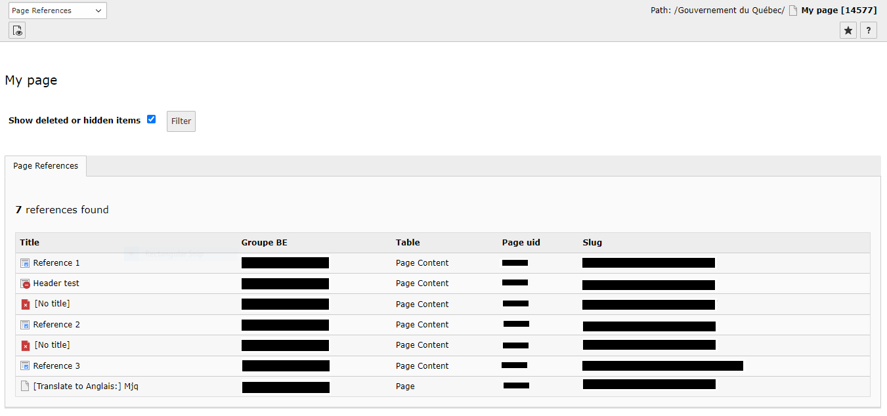

Qc References
==============================================================
*La [version française](#documentation-qc-references) de la documentation suit le texte anglais*

## About
This extension is used to display the references of a selected page as a table with the following columns:
- Title : this column represents the page title or tt_content title that refers to the selected page.

- Groupe BE : displays the group name of the user who created the reference.

- Table : this column represents the type of reference for example a page content or a page.
- UID de page : displays the UID of the reference page or the page content PID in case of the reference is a page content.
- Slug : displays the clickable slug that can be used to redirect to the FE page of the reference.


Note : the table will also display the reference state in case it is disabled, expired...

After installing this extension, references for a selected page can be found in the Info module.
TS Configuration
The extension offers two types of TS configuration, which can be modified.

###Select the types of references
This option is used to define the different types of references that can be listed in the result table.
```php
mod.qcReferences.allowedTables = pages, tt_content
```

###Control the result display
This option is used to control the display of items in the table, specifying the number of items per page that will be displayed at a time.
```php
mod.qcReferences.itemsPerPage = 100
```


Screenshot of the references table




-----------
[Version française]
# Documentation Qc References

## À propos
Cette extension sert à afficher les références d’une page sélectionnée sous forme d’une table qui porte les colonnes suivantes : 
- Le titre : cette colonne représente le titre de la page ou le tt_content qui fait référence au page sélectionnée.

- Groupe BE : affiche le nom de groupe de l’utilisateur qui a créé cette référence.

- Table : cette colonne représente le type de référence par exemple un contenu de page ou une page.
- UID de page : Affiche le UID de la page de référence ou bien le PID de contenu de page au cas où le références est de type contenu de page.
- Slug : affiche le slug cliquable qui peut être utilisé pour se rediriger vers la page FE de cette référence.


NB : la table va aussi afficher l’état de référence au cas où il est désactivé, expiré...


Après l’installation de cette extension, les références d’une page sélectionnée se trouvent dans le module Info.
Configuration TS 
L’extension offre deux types de configuration TS, qui peuvent être modifié. 


###Sélectionner les types des références 
Cette option sert à définir les différents types de références qui peuvent être listé dans la table de résultat.
```php
mod.qcReferences.allowedTables = pages, tt_content
```
###Contrôler l'affichage de résultat : 
Cette option sert à contrôler l’affichage des éléments dans la table, en spécifiant le nombre des éléments par page qui seront affiché à la fois.
```php
mod.qcReferences.itemsPerPage = 100
```
